# RNASeq Secondary Analysis

## Introduction to Secondary Analysis

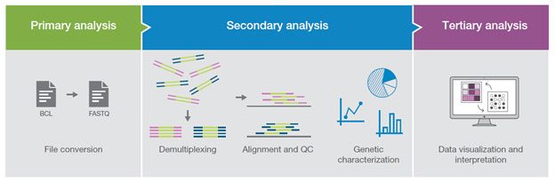

An experiment can typically be broken down into 3 different parts:

-   Primary Analysis - There can be a bit of a disjoint in the community
    about what constitutes an analysis. Some consider trimming + initial
    qc to be part of it. For this workshop, we’re going to consider this
    analysis to be the steps performed by a sequencing lab and the end
    result of this will be a demultiplexed fastq. That is very much an
    oversimplification about what happens at this step, as there is a
    lot of complexity, and entire workshops could be given (and are
    given) solely on this step.

-   Secondary Analysis - Secondary analysis is the steps in a workflow
    where fastq files are turned into the files you need for tertiary.
    The files produced differ depending on what kind of analysis you are
    performing, a single cell analysis would need a feature-barcode
    matrix, whole genome analysis would work with variant call files.
    For bulk rna analyses we are concerned with expression count files

-   Tertiary Analysis - Tertiary analysis takes the output from
    secondary and visualizes and interprets the results. Depending on
    your analysis you have a different end goal for what you want to
    see. For bulk rna-seq, we are looking for differential and
    coregulated expression of genes and to infer their biological
    meaning

Primary analysis goes beyond the scope of this lesson, these lessons
will focus primarily on secondary and tertiary analysis.

## Introduction to Fastq Files

As mentioned previously, secondary analysis starts with a fastq file. A
fastq file is a standard file format for storing the raw sequences and
their qualities obtained from primary analysis.

Taking a look at our fastqs. Taking a quick look at our file extensions,
we can tell its a fastq because it has the ‘.fq’ file extension, you’ll
also see ‘.fastq’ among others. They all mean the same thing. The other
file extension we see are ‘.gz’, this just means our file is gzipped.
Gzip is a way to compress and minimize the storage space a file takes up
on a system, this is especially important for fastqs because they can be
very large uncompressed.

```         
gunzip -c <fastq.name> | head
```

We can see that there is a sort of pattern that is discernable. Each set
of four lines is a separate entry. The four lines are:

1.  The sequence identifier. The exact contents of this vary depending
    on many different factors, but are always unique.
2.  The sequence. A string of A, T, C, G, and N. (N indicates the base
    could not be identified)
3.  A separator. Normally a ‘+’ sign.
4.  The sequence qualities. These are encoded using characters, but
    there are ways to get them back to numbers. These indicate the
    quality for the base at the same position. See the table below for
    quick guide on what each character means


### QC-ing Fastq Files

So before any analysis begins, there are a couple sanity checks that can
be run on a fastq file in order to ensure they are correct.

#### Checking line count

The first sanity check is to perform just a simple word count on the
file

```         
gunzip -c <fastq_file> \| wc -l
```

If you recall, the format of the fastq file is each entry is separated
into four lines. So a very quick sanity check to perform is making sure
the number of lines in a fastq is divisible by 4.

#### Md5 Checks

The second sanity check is a little more complex, but it’s known as an
md5 check. An md5 is a string of characters and numbers. The important
note is that the md5 is unique for every file, so two files having the
same md5 file indicates a high probability the files are the same (we
say probability because it is technically possible for two different
files to have the same md5, however because of how its calculated this
is an extremely low chance and for the purposes of this course you can
consider md5’s to be unique to a file)

The reason to perform this check is often fastqs are uploaded and
downloaded from other sources, so the md5 can be computed to determine
if there is a potential chance for corruption during either the upload
or download process. If the source does not provide any md5’s, asking
for the source of the fastq to generate them is a perfectly reasonable
request. Once these are generated you are able to check the md5s of the
fastqs after they ‘ve been downloaded against the md5’s that the source
generated, and ensuring these values are equivalent is a good way to
ensure no corruption happened during the download process.

The way to check the md5 of a file is to use the md5sum command

```         
md5sum fastq.fq.gz
```

## Intro to RNASeq

The fastq file on its own doesn’t really net much information. In order
to move forward with our project, these raw base calls need to be
converted into raw expression data.


The rnaseq pipeline developed and published by nf-core is the option
that this lesson will be using to analyze the fastqs.

The rnaseq pipeline has a lot of tools that are part of it, and you
don’t normally run all of these tools during an analysis. The pipeline

RNASeq workflows follows generally the below pattern:

1.  Read trimming/filtering
2.  (Pseudo) Alignment
3.  Counting

Interspersed throughout the workflow will be quality control steps in
order to assist in the determination of any steps where an error may
have happened or to determine viability of the samples as they progress
through the pipeline

### Trimming and Filtering

The first step in RNA-seq workflows is often read trimming and
filtering. A common type of trimming is adapter trimming. Adapters are
artificial sequences that are attached to the DNA fragments you are
wanting to sequence to ensure that the fragment attaches to the
sequencing flow cell. Adapters are normally also sequenced with the
fragment meaning some of your reads may have bases that are not
biological and can impact the accuracy of mapping and other downstream
analyses. In order to alleviate this concern there are dedicated tools
published that will remove adapters (also referred to as “adapter
trimming”). Some examples of tools that do this are TrimGalore, BBmap,
or Trimmomatic.

The Rnaseq pipeline additionally supports the removal of contamination
with bbsplit and removal of ribosomal rna using SortMeRNA.

### Alignment

Following trimming is alignment. With RNAseq, there are two different
types of alignment.

Alignment is the process by which a read is mapped to a reference
genome. STAR is considered the standard aligner for RNAseq. The reason
it is used over traditional mappers such as bwa is due to STAR being a
splice aware aligner. Being splice aware means that rather then trying
to force a read from a transcript onto the reference genome, it will try
and match it to the exons.

The second type of alignment is known as pseudo alignment. In normal
alignment you takes read and find where exactly in the reference it
falls, including information such as how each nucleotide in the read
matches up to the nucleotide in the reference. Pseudo alignment on the
other hand, produces a set of sequences a read is compatible with and
focuses on the statistics for downstream. Nf-core/rnaseq provides both
salmon and kallisto for this purpose.

### Counting

Once the reads have been aligned, the alignments (or pseudo-alignments)
are turned into counts files. This step produces an output containing a
list of features and how many reads are estimated to be apart of that
feature

## Executing the nf-core/rnaseq Pipeline

### Intro to Nextflow / nf-core

Due to the amount of steps this analysis uses, it is written using a
workflow management system (or workflow manager) known as Nextflow.
Workflow management systems allow for the chaining together of tools and
abstract out and inherently support some of the common checks that a
developer would have to program in, such as checking if a file exists,
moving output files to a central location, and logging information.
Workflow management systems are also useful as they natively support
parallelization, portability, and reproducibility. There are other
workflow languages such as Snakemake or WDL.

Nextflow is is built on top of a programming language known as Groovy.
The specifics of Groovy are not necessarily important for the lesson,
but if anyone wishes to develop pipelines using nextflow it will be
relevant.

Nf-core is a community-led effort to curate and develop a set of
analysis pipelines using Nextflow. All pipelines published as part of
nf-core are open source and there are a wide range of pipelines
published currently supporting analyses such as single-cell or atacseq.
The community itself is not specifically limited to bioinformatics, but
most pipelines published so far have all been within that field. The
other thing to note is that the nf-core team has published a lot of
standards and tools to create a styling guidelines, and that any
nextflow pipeline is able to use these standards and tools even if they
do not wish to publish as part of nf-core.

### Testing the Pipeline

So we’ll start off by logging in the cluster. One important thing to do
when trying a new pipeline or tool is to always run through the test
data. Nf-core requires all pipelines to have downsampled data to be able
to run a test profile.

```         
ssh <blazer_id>@cheaha.rc.uab.edu
```

In order to run the pipeline with test, we’ll use the following command:

```         
nextflow run nf-core/rnaseq -profile test,cheaha --outdir output
```

Breaking the command down: - `nextflow run` is how to run any nextflow
pipeline. nf-core/rnaseq tells which nf-core pipeline to run, if we were
running a single-cell pipeline, we’d use nf-core/scrnaseq. -
`-profile test, cheaha` : Profiles can be thought of as presets for a
pipeline. The pipeline comes with a lot of defaults, but the profiles
provide additional defaults for the pipeline. The ‘test’ profile tells
the pipeline that we are going to use the test data for the pipeline.
The ‘cheaha’ profile is what called an institutional profile, the one
for use at UAB is ‘cheaha’, but there are also other institutions and
you are able to create your own if one doesn’t already exist. The one
thing to note is that if you pass in multiple profiles, the last one
takes precedence. - `--outdir output` Finally we are noting where the
pipeline needs to place all the output files, in this case it will be a
directory called output.

Running the pipeline will yield a status update page. This page will
show the current progress of the pipeline, completed jobs, failed jobs,
etc. The command will also download the version of the pipeline
specified so it can be run more easily in the future.

Once everything is completed, move on to the next section as we can
conclude the pipeline has been downloaded successfully.

### Understanding the Dataset

So lets start moving to actual data. In order to run the data, its
important to understand the data a little more before proceeding.

The data comes from the below paper:
<https://www.ncbi.nlm.nih.gov/pmc/articles/PMC6096346/>

The data that we will be analyzing is mouse transplant data. There are
12 samples in total - 4 naive controls, 4 from 2 hours past transplant,
and 4 from 24 hours past transplant. For this workshop, we will only be
concerned with the controls and the 2 hour samples. And for the
secondary portion of the workshop, we will be reviewing results for a
full pipeline run. However, for testing purposes we are going to run
down sampled versions of the data, but the steps we will follow will be
applicable to the full dataset.

Another thing to note is the paper we are obtaining the data from is a
beginner’s guide for rnaseq published about 10 years ago. If anyone has
gone through the paper, you will notice that there are some differences
from the analysis that was done for the paper versus the analysis done
today. The reason is a lot of the tools used by the paper are considered
outdated or have been phased out of the field. Bioinformatics as a whole
is a very fast moving field, and it is very important to ensure that all
analyses are using correct and modern approaches because it will come
up. So always take the chance to make sure that the tools you use are
still being used in more recent papers.

### Creating the Samplesheet

So lets work on running the pipeline on actual data. The RNAseq pipeline
(like most nf-core pipelines) receives input via a samplesheet. The
format of which can be seen here:

<https://nf-co.re/rnaseq/3.14.0/docs/usage>

So let’s start by making a samplesheet.csv. For the workshop, we’ll use
vim. And we'll go ahead and enter the header

```         
vim samplesheet.csv
```

```         
sample,fastq_1,fastq_2,strandedness
```

We’ve put the header into the samplesheet, so let’s save the samplesheet
because we need to also include the fastqs. The way we will do that is
via the commandline.

```         
for file in input/downsample/*.fastq.gz; do echo $file; done
```

That will output all the fastqs we will be working with. Lets redirect
the output to the end of the samplesheet

```         
For file in input/downsample/*.fastq.gz; do echo $file; done >> samplesheet.csv
```

So open up the samplesheet again. So there’s currently a header and a
list of fastqs. To start modifying it, a sample name needs to be added
with some additional commas.

```         
sample,fastq_1,fastq_2,strandedness
naive_1,/path/to/fastq_1,,auto
transplant_2hr,/path/to/fastq_1,,auto
```

The sample name is completely up to the user, so pick something that
will help with identification for yourself if there is not an already
existent sample name. Strandedness we have set to auto for the purposes
of the workshop, if you know if the data is forward or reverse stranded
by all means use that instead.

### Adding Pipeline Parameters

One point of customization is the pipeline parameters. The amount of
configurability the parameters provide is very dependent on the pipeline
and the pipeline authors, so we won’t be able to customize every aspect
of the pipeline, but parameters are often based on common requests by
users of the pipeline.

The parameter options for an nf-core can be found on the pipeline
website, for rnaseq its available here:
<https://nf-co.re/rnaseq/3.14.0/parameters>

There are a lot of options, its very rare that you will need all of
these. But these range from everything from required inputs to which
steps to run in the pipeline. It is encouraged to read through this when
doing your own analysis to see if there are any flags that may apply.

Parameters are able to be passed as flags to the command line or via a
yaml file. For the workshop, we will use the yaml option in order to
keep the command a little clean.

Open up a file called params.yml using vim

```         
vim params.yml
```

```         
# names/email
email: "atrull@uab.edu"
multiqc_title: "rnaseq_workshop"
```

So the first things to add are our email and the title, we’ll get an
email anytime the pipeline fails or succeeds.

```         
# input samplesheet
input: "./samplesheet.csv"

# Genome references
fasta: "/path/to/fasta"
gtf: "/path/to/gtf"
gencode: true
```

Next we’ll provide the required parameters. Input is the path to the
samplesheet. Fasta and GTF are the paths to the fasta and gtf for the
analysis. Note that these can be obtained from the GENCODE website at
<https://www.gencodegenes.org/>. For genomes not available you can also
find reference files at the ensembl website
<https://useast.ensembl.org/index.html>. If you use GENCODE reference
files, be sure to set the gencode parameter to true.

```         
# Read Trimming Options
trimmer: "trimgalore"
extra_trimgalore_args: "--illumina"
```

We are going to use trimgalore for the trimmer. RNASeq also provides
fastp as an option. Neither one of these is necessarily better than the
other, trim_galore provides a wrapper around an older tool called
cutadapt and fastqc. Trim_galore will try to guess the adapters it needs
to cut, you can limit this by passing certain parameters. This dataset
uses the illumina default adapters, so the “--illumina” flag needs to be
passed to the tool.

```         
# Alignment Options
aligner: "star_salmon"
pseudo_aligner: "salmon"
#extra_salmon_quant_args: "--seqBias --gcBias"
```

The aligner we use is “star_salmon”. For rnaseq, this means STAR will be
the aligner and salmon will be used for quantification. We can also tell
it to produce pseudo alignments using salmon. The additional arguments
to salmon are to help the model it uses to correct for sequence and gc
bias.

```         
# Quality Control
deseq2_vst: true
```

We'll also add this parameters for the run. - `deseq2_vst` will use the
vst transformation over deseq's rlog. This is ideal as vst is faster to
run and more suitable for larger datsets

### Additional Customization

Parameters are very useful, but can only get so far. An additional route
of customization is to use the custom configuration files implemented
within nextflow. Custom configs allow customization of everything from
resource allocations to addition of parameters to specific tools in the
pipeline.

Lets start by changing the queue. The cheaha profile will pick a queue
based on the profile defaults. Since we’re using donwsampled data,
everything will run very quickly, in order to facilitate that we’ll make
it so the default queue is 'express'.

```         
process {
    executor = 'slurm'
    queue = ‘express’
}
```

Custom configuration works off the idea of scopes – what this means is
users can group settings so they apply to specific pieces of the
pipeline.

The above lines of code set the executor to be slurm, and set the queue
so that all jobs will be submitted to the 'express' partition on cheaha

Another item that can be configured via this method is adding parameters
to specific tools in the pipeline. In order to do that, you will need to
find the module. For this example, let’s modify the Salmon script. There
is a way to do this via the pipeline parameters, however, its also a
great way to show custom configs.

The first step to do that is to find the name of the process. To do
that, its important to understand the nf-core directory structure a
little better. Let’s start by changing into the rnaseq directory that
was downloaded when the test command was executed.

```         
cd ~/.nextflow/assets/nf-core/rnaseq/
```

There’s a lot of files and directories in here, breaking down the
directories one at a time: - `assets` - Contains images and tool-specfic
files - `bin` -Contains scripts used by the pipeline - `conf` - Contains
pipeline configuration files - `docs` - Contains documentation -
`libs` - Contains groovy libraries for the pipeline to use - `modules` -
Contains the nextflow process files for individual tools. It is further
split into ‘local’ modules which are unique to the pipeline and
‘nf-core’ modules which are files that have been obtained from a central
repo. - `subworkflows` and `workflows` - Contains the actual workflow
files themselves. `subworkflows` are parts of a workflow that are
repeated multiple times so are abstracted out of the main workflow to
alleviate the maintenance burden.

There are additional files in the pipeline directory, but most of these
are used for either documentation or for the pipeline template. For the
purposes of this workshop, these are largely unimportant but are very
important should someone choose to write an nf-core style pipeline.

To find Salmon, we need to search down the `modules` directory. There
are two bash commands that can be executed to find the Salmon process
file:

```         
find modules -name "*salmon*"
```

OR

```         
grep -rl "salmon" modules/
```

The ‘find’ command assumes that there is a file or directory that is
named like the tool, this isn’t always the case so the grep can help in
the cases where find fails to find anything.

We can see that the salmon module is located at
`modules/nf-core/salmon/quant`. So lets open up the process file.

```         
vim modules/nf-core/salmon/quant/main.nf
```

The name of the process is at the very top of the file, which is what we
need. Feel free to explore this, but a lot of this nextflow syntax.
Special attention should be paid to the command for the tool which is
located towards the bottom of the file.

So with the name of the process, let’s go back and open up the custom
configuration file and add the below lines.

```         
vim custom.conf
```

```         
process{
withName: ‘.*:SALMON_QUANT’{
    ext.args = ‘--gcBias --seqBias’
}
```

So what the lines will do is when salmon is ran, two additional flags
will be added. The flags themselves tell salmon to correct for gc and
sequence bias. We use withName to limit the additions to only the salmon
process, we don’t want to run it for everything. Since withName respects
regular expressions we use the .\* to act as a catchall for all salmon
jobs.

There are additional ways you can use this config, controlling whether
nextflow processes are run with Singularity or Docker, further
configurations with processes such as controlling memory or cpus making
this method a very powerful tool for modifying a pipeline.

### Submitting the pipeline

With all the files created, we can submit the pipeline using the below
command:

```         
nextflow run nf-core/rnaseq \
    --outdir ./subsample_results \
    -profile cheaha \
    -with-report report.html \
    -with-timeline timeline.html \
    -r 3.14.0 \
    -params-file ./params.yml \
    -c custom.conf
```

You can see we add some additional flags form the test run.

-   `with-report` and `with-timeline` each produce files about the
    pipeline run itself, nothing specific to data. We’ll review them
    more in-depth later in the lesson.

-   The `-r` specifies a version of the pipeline to use. This is an
    important parameter for reproducibility as we can force rnaseq to
    run at a specific version.

-   Finally we add in the files we have just created in the previous
    steps with their respective parameters

## Reviewing Pipeline Results

### Pipeline Metrics

With the previous commands, there are 2 html files that were produced.
The `report.html` and `timeline.html` files.


The report file provides details on the resource and timings for each
process that was executed as part of the pipeline. This is useful in
helping to narrow down resource allocations and identify any
'problematic' jobs that occur.

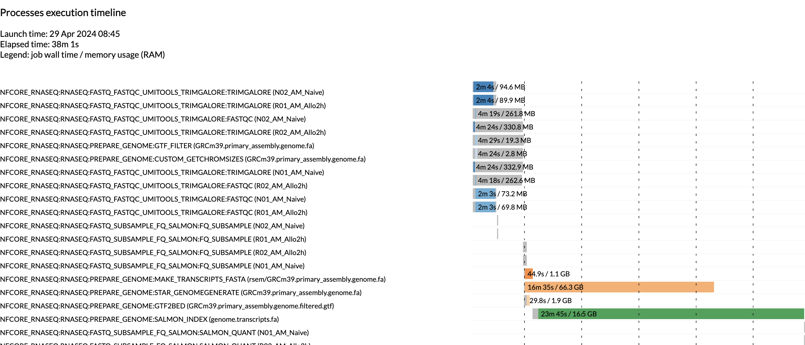

The timeline file provides a timeline of when each process was executed.
This is especially useful in being able to estimate how long a pipeline
may take and to identify long running tools.

### Pipeline MultiQC Report

The first point of review for the pipeline is the multiqc report.
MultiQC is a very useful tool that aggregates a number of different
tools into a single report, providing a quick way of reviewing the
quality of the data and determine any potential concerns about the data.

The first table in the multiqc report is the General Statistics Table.
This provides a high level overview of various metrics, from read counts
in the bam to read counts in the fastq. Its a lot of statistics, but can
be good to see if there are any large amount of filtering to occur.

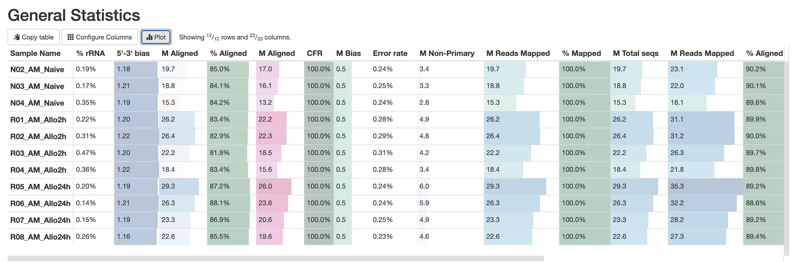

RNASeq does the very initial stages of tertiary analysis. It is
definitely recommended to do these on your own rather than rely on the
results from rnaseq as these are very generic. These results help
indicate if there are any outliers within your dataset or if there are
potential sample swaps that may be a concern as we expect samples that
are similar to each other to indicate that.

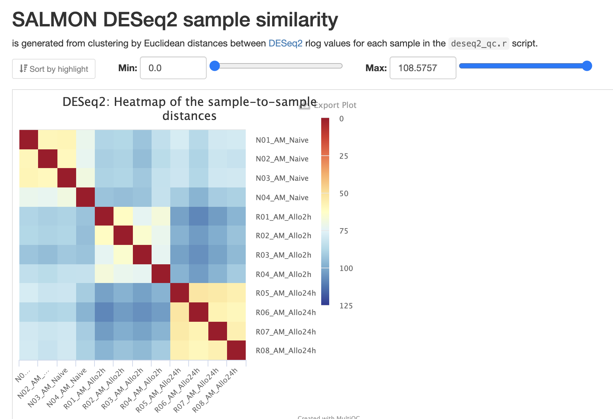

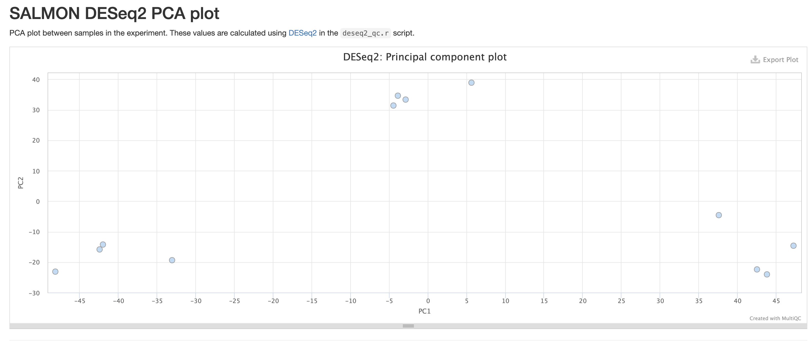

The next three qc reports are very useful for rnaseq. We expect these
reads to be from exonic, protein coding regions. These QC's act as good
sanity checks that our data matches our assumptions


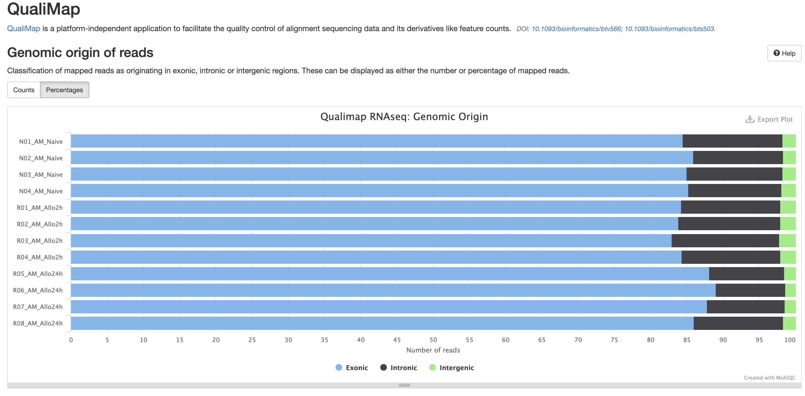

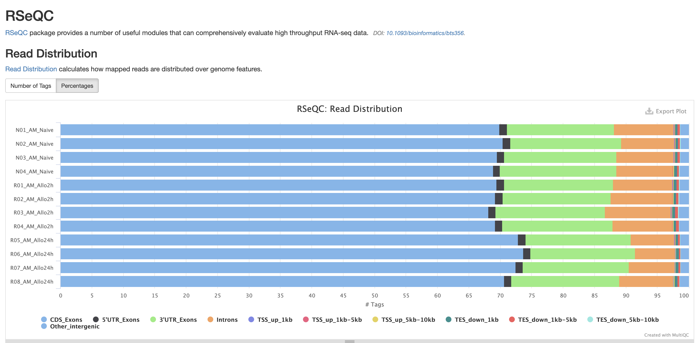

RSEQc is tool with a lot of qc's within. In addition to the above, it
also lets us check for duplication levels. The image below is indicative
of a good 'normal' plot for this metric.

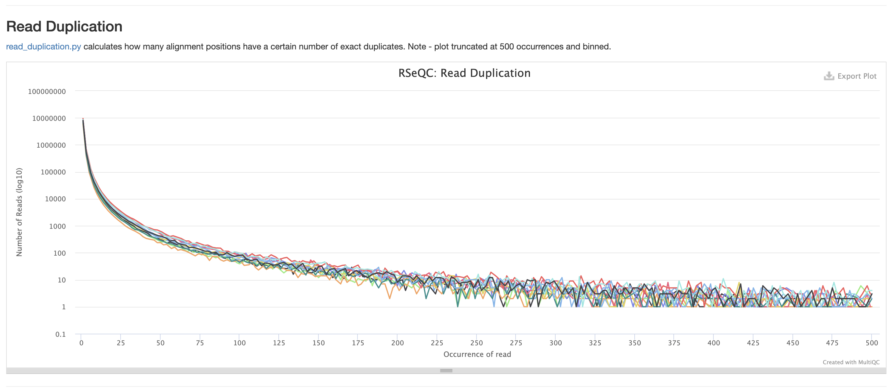

There are a couple variations of bam metrics. Samtools is a common tool
with a number of subtools that provide useful metrics for your bam. The
key things to look for are mapping rates, unique mappings, (and properly
paired in the case of paired fastqs) as those are expected to be high
regardless of dataset, though the degree varies based on species.

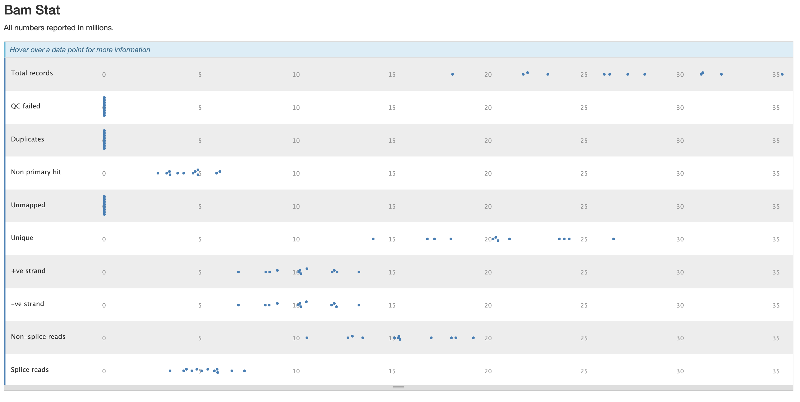  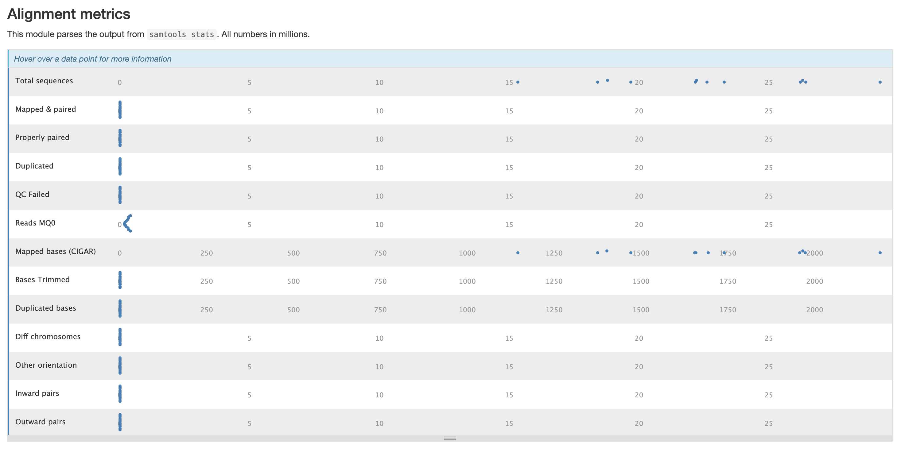
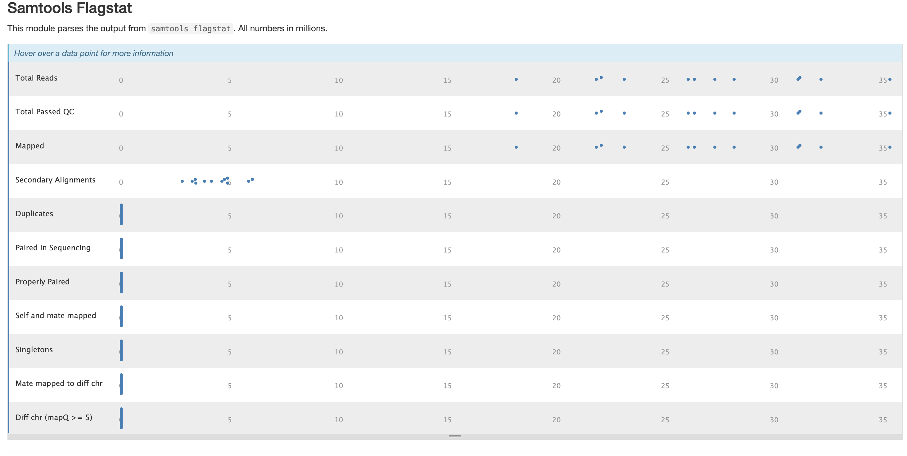

The mappings per chromosome can vary, but in general the smaller the
chromosome the less mappings will occur, so this graph is pretty normal.

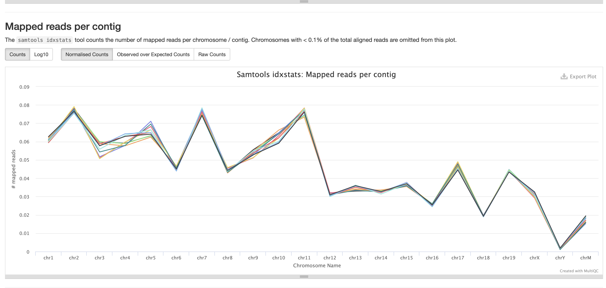

In the case of experiments involving multiple sexes of organisms, the XY
count chart can be very useful for ensuring no sample swap has occurred.

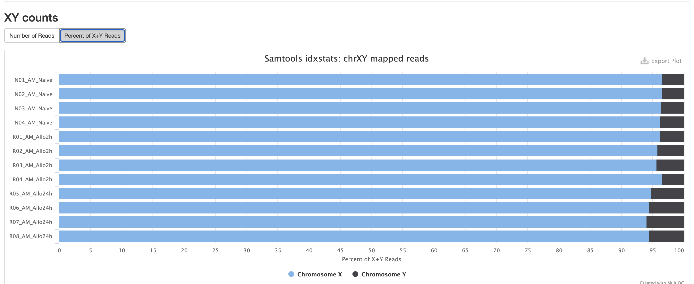

In addition to samtools, STAR provides its own versions. We again are
looking for high unique mappings. Multi mapped regions are okay though,
we just need to make sure they are not the overwhelming majority.

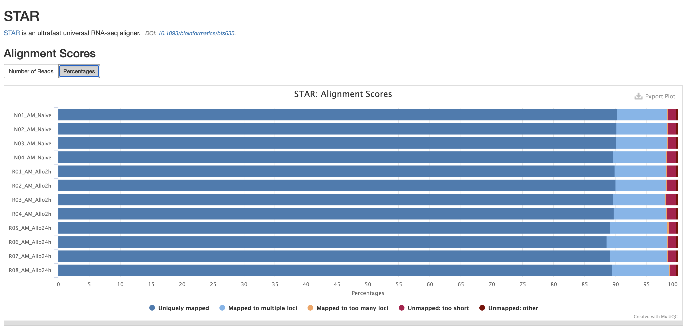

FastQC is a very common tool used for providing metrics for Fastq files.
There is also a FastQC report that gets generated, but its on a
per-sample basis and as a result does not aggreate the results like in
MultiQC.

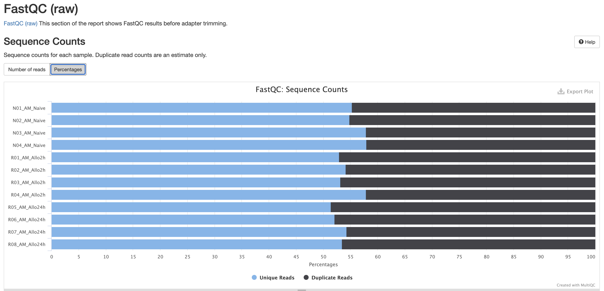

For short read data, we expect the mean quality score to remain well in
the green section. But its important to note that there are quality
drops at the start and end of the read and this is a result of the
technology, its normally recommended to trim off the beginning and ends
as a result.

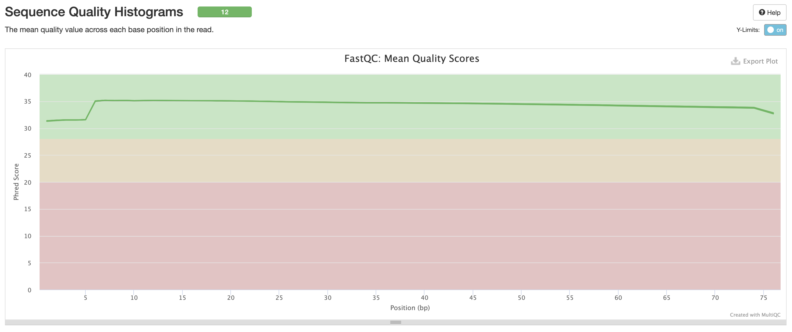 

The Per Base Sequence Content is very useful for determing if there is
any potential issue with the fastq. You'll again notice there are issues
at the start and end of the reads and its universal across samples.
Clicking each row provides a better view of which base is the strongest.
This is again pretty expected for reasons mentioned earlier, but always
worth investigating

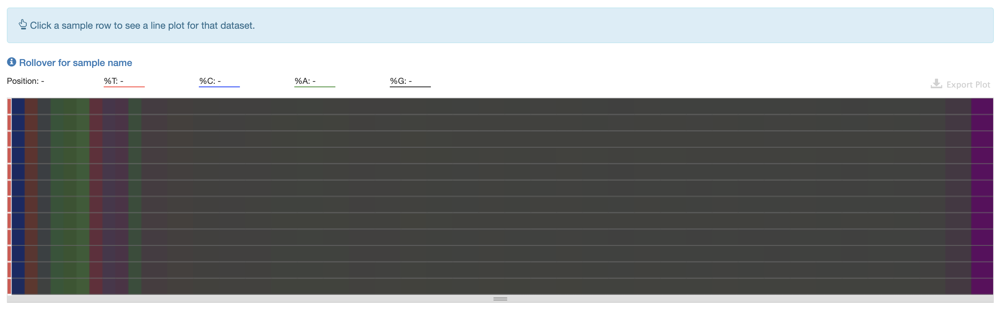 

This is pretty typical GC Content, anything wrong with this could
indicate species contamination.

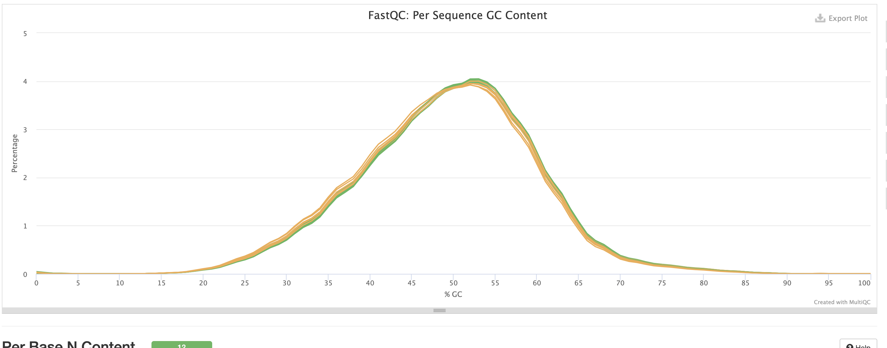

Per Base N Content indicates how many 'N's' were detected in the
dataset. N's mean the base was unable to be determined, and high levels
could indicate a potential sequencer error and mean the current data is
unusable.

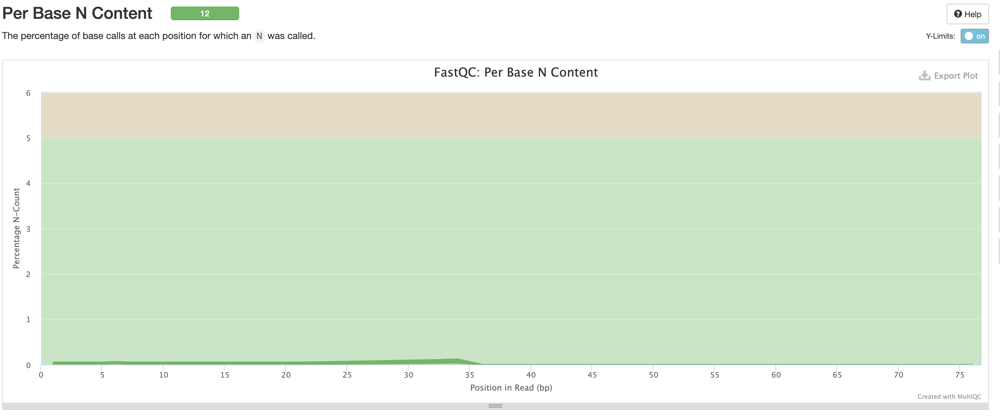  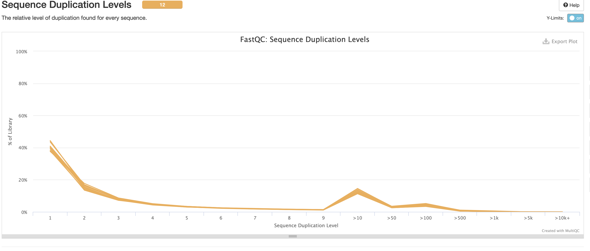

We expect a level of adapters in our data, however note that this is pre
trimming so this should mostly be clipped out at that step.

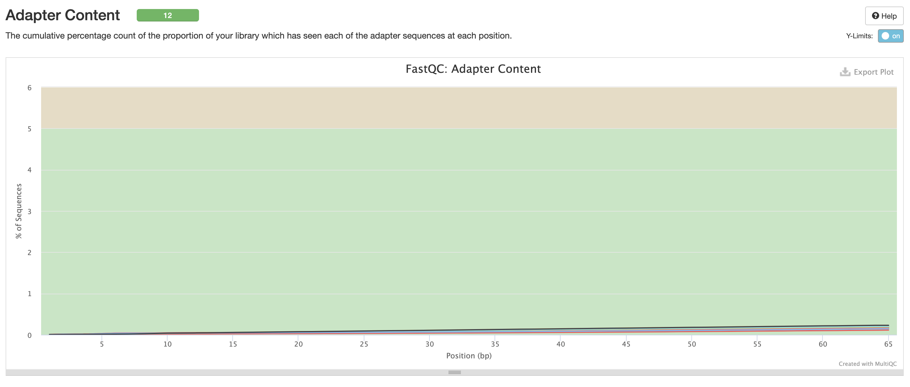

Finally there are the pipeline data. Just below the citations, are the
tool versions. This is useful to know when trying to reproduce analyses
as you will want to match the versions perfectly.

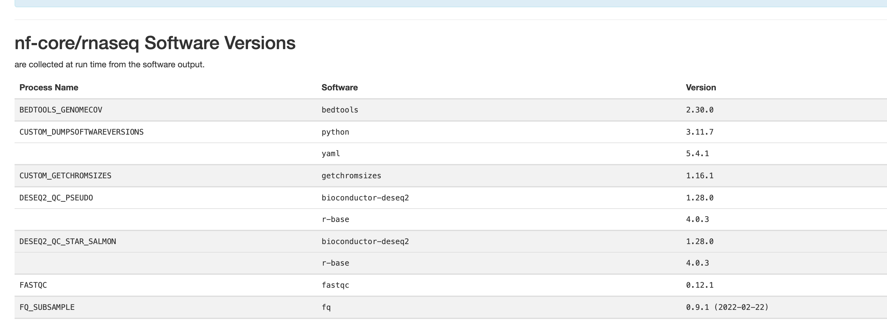

The workflow summary indicates what parameters and options were used
during the analysis.

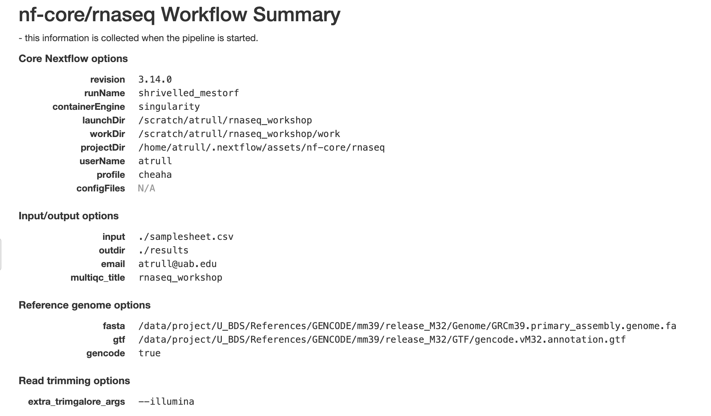
